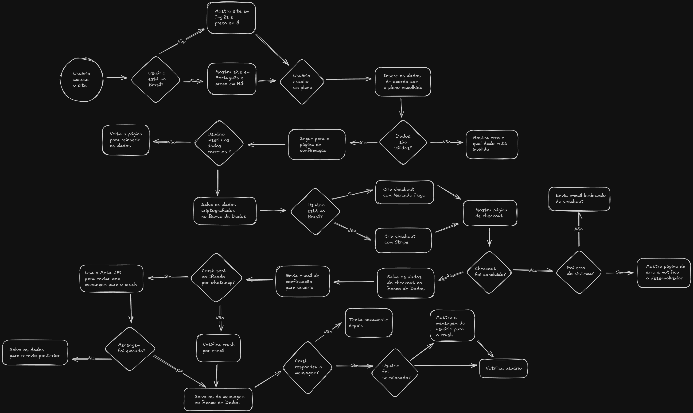

# Crush Anônimo Doc

## Visão Geral

O **Crush Anônimo** é uma plataforma que possibilita aos usuários enviarem mensagens totalmente anônimas para seus crushes, criando oportunidades de descobrir se o interesse é recíproco de forma divertida, segura e confidencial. O sistema oferece diferentes planos (gratuito, básico e premium), cada um com funcionalidades exclusivas, como notificações por WhatsApp ou email, respostas detalhadas e recursos premium para tornar a experiência ainda mais completa e personalizada.

## Tecnologias

### Frontend
- **Next.js 15** - Framework React
- **React 19** - Biblioteca de UI
- **TypeScript** - Tipagem estática
- **Tailwind CSS** - Framework CSS
- **Radix UI** - Componentes acessíveis
- **Shadcn/ui** - Sistema de design
- **Framer Motion** - Animações
- **Google libphonenumber** - Validação de números de telefone

### Backend
- **Next.js API Routes** - Backend serverless
- **Prisma ORM** - Gerenciamento de banco
- **PostgreSQL** - Banco de dados
- **NextAuth.js** - Autenticação

### Pagamentos
- **Stripe** - Pagamentos internacionais (Cartão)
- **MercadoPago** - Pagamentos Brasil (PIX, Cartão, Boleto)

### Notificações
- **WhatsApp Business API** - Mensagens WhatsApp
- **Resend** - Serviço de email
- **React Email** - Templates personalizados

### Infraestrutura
- **Vercel** - Deploy e hosting
- **Neon Tech** - Banco PostgreSQL serverless
- **Jest** - Testes unitários

## Fluxo Completo do Sistema

[Fluxo do Crush Anônimo - Excalidraw Link](https://excalidraw.com/#json=esnBiB0MyItGMZHJR7B6N,WN_kfK2n96dF5PVIEE2gJA)

### 1. **Início e Configuração Regional**
- **Usuário acessa o site**: O fluxo começa com o usuário acessando a aplicação
- **Decisão**: "Usuário está no Brasil?"
  - **Se SIM**:
    - Mostra site em Português e preço em reais R$
    - Configura MercadoPago como provedor de pagamento
  - **Se NÃO**:
    - Mostra site em Inglês e preço em dolar $
    - Configura Stripe como provedor de pagamento

### 2. **Seleção de Plano e Inserção de Dados**
- **Usuário escolhe um plano**: Após a configuração regional, o usuário seleciona um plano (gratuito, básico ou premium)
- **Insere os dados de acordo com o plano escolhido**: O usuário preenche as informações necessárias
- **Decisão**: "Dados são válidos?"
  - **Se NÃO**:
    - Mostra erro e qual dado está inválido
    - Retorna para inserção de dados
  - **Se SIM**:
    - **Decisão**: "Usuário inseriu os dados corretos?"
      - **Se NÃO**: Volta a página para reinserir os dados
      - **Se SIM**: 
        - Segue para a página de confirmação
        - Salva os dados criptografados no Banco de Dados

### 3. **Processo de Checkout**
- **Decisão**: "Usuário está no Brasil?"
  - **Se SIM**: Cria checkout com Mercado Pago
  - **Se NÃO**: Cria checkout com Stripe
- **Mostra página de checkout**: A página de checkout é exibida ao usuário
- **Decisão**: "Checkout foi concluído?"
  - **Se NÃO**:
    - Envia e-mail lembrando do checkout
    - **Decisão**: "Foi erro do sistema?"
      - **Se SIM**: Mostra página de erro e notifica o desenvolvedor
      - **Se NÃO**: Fluxo termina (usuário pode tentar novamente)
  - **Se SIM**: Salva os dados do checkout no Banco de Dados

### 4. **Envio da Mensagem e Interação Pós-Envio**
- **Envia e-mail de confirmação para usuário**: Confirmação é enviada ao usuário que realizou a compra
- **Decisão**: "Crush será notificado por whatsapp?"
  - **Se SIM**:
    - Usa a Meta API para enviar uma mensagem para o crush
  - **Se NÃO**:
    - Notifica crush por e-mail
- **Decisão**: "Mensagem foi enviada?"
  - **Se NÃO**:
    - Salva os dados para reenvio posterior
  - **Se SIM**:
    - Salva os dados da mensagem no Banco de Dados
    - **Decisão**: "Crush respondeu a mensagem?"
      - **Se NÃO**:
        - Tenta novamente depois
      - **Se SIM**:
        - Mostra a mensagem do usuário para o crush
        - **Decisão**: "Usuário foi selecionado?"
          - **Se SIM**: Notifica usuário sobre a seleção

### Características Principais

- **Múltiplos Planos**: Free, Basic e Premium
- **Pagamentos Internacionais**: Stripe e MercadoPago
- **Notificações Multi-canal**: WhatsApp e Email
- **Sistema de Afiliados**: Vendedores com comissões
- **Grupos de Crush**: Funcionalidade premium
- **Painel Administrativo**: Gestão completa para admin e vendedores
- **Métricas Avançadas**: Analytics em tempo real
- **Responsivo**: Design adaptativo para todos os dispositivos
- **Interação Completa**: Sistema de resposta e match
- **Segurança**: Dados criptografados, autenticação robusta, validações no servidor

## EM DESENVOLVIMENTO

## Criado por:

### Vinicius Leonel

### Linkedin: https://www.linkedin.com/in/viniciuslps
